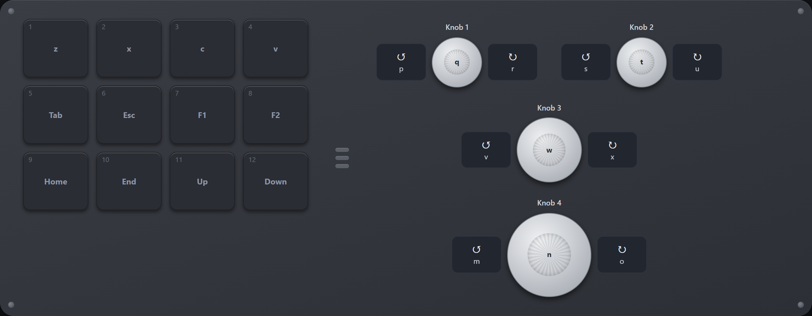

# MiniKeyboard

12 キー + 4 ノブ / 3 レイヤー / RGB のマクロパッド（`514c:8850`）を設定するアプリケーション。

[English](README.md)



**→ [ブラウザで開く](https://takamorita.github.io/MiniKeyboard-514c-8850/)**

インストール不要。設定はブラウザに保存されます。

WebHID を使うため **Chrome / Edge のみ。**

---

## 機能

- 12 キー + 4 ノブ（左回し / 右回し / 押し込み）× 3 レイヤーの割り当て
- キー / 修飾キー / マウス操作 / メディアキーを順序付きの入力列として登録
- RGB の点灯モードと色
- 設定の JSON 書き出しと読み込み

キーは打てる文字で指定できる。`[` を入力すると JIS 配列で `[` が出るキーコードが選ばれる。

## 使い方

1. キーボードを USB で直接接続する（ハブ経由・無線では書き込めない）
2. 「Connect device」でデバイスを選択
3. 割り当てを編集して「Write to device」

## デスクトップ版

Windows 11 で動作確認済み。

[Releases](https://github.com/takamorita/MiniKeyboard-514c-8850/releases) から
`minikeyboard-windows-amd64.exe` を取得。exe 単体で動作する。

---

## ビルド

Go 1.21 以上。

```bash
make dev        # 開発サーバ http://127.0.0.1:8777/
make build      # minikeyboard.exe
make release    # dist/ に amd64 / arm64 の exe と Pages 用ファイル
```

make が無い場合:

```bash
cd app-go
go run . --dev
go generate ./... && go build -ldflags="-H windowsgui -s -w" -o ../minikeyboard.exe .
go run gen/release.go
```

---

## 注意

- 書き込みは USB で直接接続した場合のみ。無線や USB ハブ経由では書き込めません
- 書き込み前に Export でバックアップを取ってください
- 非公式ツールです。自己責任でご利用ください

## ライセンス

[MIT](LICENSE)
